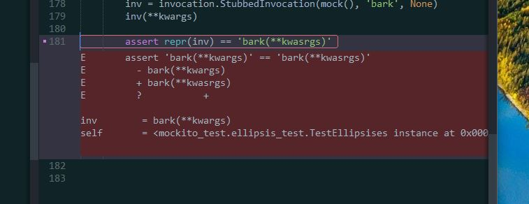

# py.test plugin for the sublime text editor

The plugin basically runs your tests, and annotates your files using the tracebacks.

# Common workflow

The defaults: it will run your tests on save; it will not show the output panel but annotate your views on failures instead. Like so:

Which test it will run depends on the red/green status of the previous run, and if you're currently editing a test file or an implementation file. It should work really okay. Set `"mode": "manual"` and just use your own key bindings if you think that's stupid. See `Default.sublime-commands` for some examples.

You __really__ should add

    {
        "class": "status_bar",
        "settings": ["pytest_is_red"],
        "layer0.tint": [155, 7, 8], // -RED
    },

to your `.sublime.theme` to flash the status bar early if there are failures. [Consider [instafail](https://github.com/pytest-dev/pytest-instafail) to get early failures with full tracebacks as well.]

Likewise add

    {
        "class": "status_bar",
        "settings": ["pytest_is_green"],
        "layer0.tint": [8, 131, 8], // -GREEN
    },
    {
        "class": "label_control",
        "settings": ["pytest_is_green"],
        "parents": [{"class": "status_bar"}],
        "color": [19, 21, 32],
    },

to get a status bar notification if we're green.

You probably should also have a keybinding to show/hide the output panel quickly. See [TogglePanel](https://github.com/kaste/TogglePanel/)

# Install

As long as it's not listed, you must manually download/clone from github and put it in your Packages directory.

At least **look** at the global settings. You usually have to edit the `pytest` setting to point at your py.test from your current virtualenv (the default is to run your global py.test which is usually *not* what you want). E.g.

    "pytest": "~/venvs/{project_base_name}/bin/py.test"
    OR:
    "pytest": ".env\\Scripts\\py.test"
    OR even:
    "pytest": "venv/path/to/python -m pytest"

The plugin will expand ${project_path}, ${project_base_name}, ${file}, etc. as usual. It will respect your `project-settings` like:

    {
      "folders":
      [
        {
          "path": "."
        }
      ],
      "settings": {
        "PyTest": {
          "mode": "auto",
          "options": "--tb=short -l -ff",
        },
      }
    }

# TODO

- Parametrized tests are hard. We should somehow get the id of the test item and show it. Also: for parametrized tests the same test can fail multiple times; currently we just show multiple phantoms.
- XPASSED's are hard too. When a test xpasses we don't have a traceback, so we don't have proper phantoms as well. Currently we just pop up the output panel.

